# UI Implementation Plan for Dogfood Hackathon Platform

This plan outlines the architecture, page structure, and design for a complete, self-hostable, server-rendered web UI for Dogfood. It addresses all frontend requirements across **T1 (Core)** and **T2 (Judging)** while complying strictly with offline self-hosting constraints, backend-enforced security, and the shot-by-shot requirements of [DEMO-SCRIPT.md](file:///c:/Users/kultzuki/Coding/Dogfood/DEMO-SCRIPT.md).

> [!IMPORTANT]
> **Zero External Dependencies Constraint**: All templates use local Nunjucks SSR with existing local CSS ([static/css/main.css](file:///c:/Users/kultzuki/Coding/Dogfood/static/css/main.css)). No CDN scripts, remote fonts, or external client libraries will be introduced. All state mutations follow the Post/Redirect/Get (PRG) pattern with CSRF protection and server-side validation.

---

## User Review Required

> [!WARNING]
> **Weighted Rubrics UI vs Data Model**:
> The backend currently stores scores as a single scalar `value` (0–100), while T2 explicitly requires *"weighted, organizer-configurable judging rubrics"*. We propose rendering a multi-criteria rubric form in the UI that computes weighted composite scores, while updating the backend schema to persist criteria breakdowns.
>
> **Navigation Model**:
> Should navigation adapt automatically based on the active session's system/event role (Participant, Judge, Organizer, Admin) with role-tailored header navigation links?

---

## Architecture & Design Principles

1. **Server-Side Rendered (SSR) with Nunjucks**:
   Fastify + `@fastify/view` + Nunjucks. Eliminates client-side hydration bugs, guarantees fast first-contentful paint, and works seamlessly with offline restrictions.
2. **Form Handling & PRG Pattern**:
   Forms submit standard `POST` requests with hidden `_csrf` tokens. Successful mutations redirect (302/303) with session flash messages or query parameter status indicators (`?saved=1`, `?submitted=1`).
3. **Role-Enforced Presentation**:
   The UI reflects permissions cleanly, but all data fetching and mutations strictly execute through server-side authorization guards returning `404 Not Found` upon access violation.
4. **Offline First & Accessible**:
   Semantic HTML5, ARIA landmark roles, accessible form labels, keyboard navigation, and zero external network requests.

---

## Proposed UI Map & Component Breakdown

```mermaid
graph TD
    A[Base Layout: layout.njk] --> B[Public / Auth Pages]
    A --> C[Participant Pages]
    A --> D[Judge Pages]
    A --> E[Organizer / Admin Pages]

    B --> B1[Login: login.njk]
    B --> B2[Register: register.njk]
    B --> B3[Gallery: gallery.njk]
    B --> B4[Project Showcase: project_detail.njk]

    C --> C1[Dashboard: participant_dashboard.njk]
    C --> C2[Team Invite & Roster: team_view.njk]
    C --> C3[Team Join Landing: team_join.njk]
    C --> C4[Project Draft & Edit: project_form.njk]
    C --> C5[Version History: project_versions.njk]

    D --> D1[Judge Queue: judge_queue.njk]
    D --> D2[Scoring & Rubric Form: judge_ballot.njk]

    E --> E1[Event Control & Lifecycle: event_manage.njk]
    E --> E2[Judging Progress Dashboard: judging_progress.njk]
    E --> E3[Audit Log Viewer: audit_log.njk]
    E --> E4[CSV Data Hub: data_hub.njk]
```



---

## Detailed Page Specifications

### 1. Global Shell & Navigation
#### [templates/layout.njk](file:///c:/Users/kultzuki/Coding/Dogfood/templates/layout.njk)
* **Header Navigation**:
  * Brand logo & event title.
  * Role-aware navigation links:
    * *Public*: Gallery, Sign In, Register.
    * *Participant*: My Project, My Team, Gallery, Sign Out.
    * *Judge*: Assigned Projects, Gallery, Sign Out.
    * *Organizer/Admin*: Event Admin, Judging Progress, Audit Log, Data Hub, Gallery, Sign Out.
* **Flash Message Component**:
  * Global banner alerts (`alert--success`, `alert--error`, `alert--warning`) for feedback messages.

---

### 2. Authentication & Account Creation (T1 Core)
#### [NEW] [templates/register.njk](file:///c:/Users/kultzuki/Coding/Dogfood/templates/register.njk)
* **Purpose**: Allow new users to create accounts on localhost without third-party auth.
* **Fields**: Name, Email, Password, Role selector (`participant` by default; option for `judge` or demo accounts).
* **Security**: CSRF token, rate limit feedback, validation error display.

#### [MODIFY] [templates/login.njk](file:///c:/Users/kultzuki/Coding/Dogfood/templates/login.njk)
* **Enhancements**: Add link to `/register`, demo account quick-fill hints for local judging evaluation (`admin@dogfood.local`).

---

### 3. Team Formation & Invite Flow (T1 Core)
#### [NEW] [templates/team_join.njk](file:///c:/Users/kultzuki/Coding/Dogfood/templates/team_join.njk)
* **Route**: `GET /events/:eventId/teams/join?token=:token`
* **Purpose**: Resolves the invite token, displays team name, current roster count, and max capacity.
* **Action**: "Join Team" button posting to `/api/events/:eventId/teams/join`. Handles `already_teamed` and `team_full` states with descriptive alerts.

#### [NEW] [templates/team_view.njk](file:///c:/Users/kultzuki/Coding/Dogfood/templates/team_view.njk)
* **Route**: `GET /events/:eventId/my-team`
* **Purpose**: Team roster hub.
* **Features**:
  * Team name, current members list with join dates.
  * Copyable invite link (`/api/events/:eventId/teams/join?token=...`).
  * "Rotate Invite Token" action to invalidate shared links when team is full.
  * Link to create/edit team's project submission.

---

### 4. Project Submission & Draft Portal (T1 Core)
#### [NEW] [templates/project_form.njk](file:///c:/Users/kultzuki/Coding/Dogfood/templates/project_form.njk)
* **Route**: `GET /events/:eventId/projects/edit` or `GET /projects/:projectId/edit`
* **Features**:
  * **Draft vs Submitted Status Banner**: Visual badge indicating status.
  * **Database-Clock Countdown**: Displays server `submissions_close_at` deadline clearly.
  * **Form Fields**:
    * Title (required, ≤ 255 chars)
    * Tagline (optional)
    * Description (Markdown supported textarea)
    * Track Selection (radio/dropdown populated from event tracks)
    * Tech Tags (comma-separated or tag badges)
    * Organizer Custom Questions (dynamically rendered from `custom_questions` table: text, number, choice)
  * **File Upload Component**:
    * Direct multipart upload for screenshots/demo attachments (enforces 10MB cap).
    * Thumbnail preview for uploaded images.
  * **Actions**:
    * "Save Draft" (`PATCH /api/events/:eventId/projects/:projectId`)
    * "Submit Final Project" (`POST /api/events/:eventId/projects/:projectId/submit`) with confirmation modal.
    * Post-deadline lock indicator (disables submit button when `now() > deadline`).

#### [NEW] [templates/project_versions.njk](file:///c:/Users/kultzuki/Coding/Dogfood/templates/project_versions.njk)
* **Route**: `GET /projects/:projectId/versions`
* **Purpose**: Inspect immutable version audit snapshots created by the PostgreSQL append-only trigger. Shows diffs between version revisions.

---

### 5. Enhanced Public Gallery & Project Detail (T1 Core)
#### [MODIFY] [templates/gallery.njk](file:///c:/Users/kultzuki/Coding/Dogfood/templates/gallery.njk)
* **Enhancements**:
  * Add card thumbnails / upload previews.
  * Add direct links to individual project view (`/gallery/:projectId`).
  * Display tech tags as colored pills and track affiliation badge.

#### [NEW] [templates/project_detail.njk](file:///c:/Users/kultzuki/Coding/Dogfood/templates/project_detail.njk)
* **Route**: `GET /gallery/:projectId`
* **Purpose**: Public showcase page for submitted projects.
* **Content**: Title, tagline, track, team name, description, screenshots carousel/grid, tech tags, and custom question responses.

---

### 6. Judge Assignment Queue & Scoring Ballot (T2 Judging)
#### [NEW] [templates/judge_queue.njk](file:///c:/Users/kultzuki/Coding/Dogfood/templates/judge_queue.njk)
* **Route**: `GET /events/:eventId/judge`
* **Features**:
  * Personal assigned project queue (`GET /api/assignments/mine`).
  * Status badges: `PENDING REVIEW`, `SCORED (v1)`, `NEEDS RESCORE`.
  * Assigned track scope indicator.
  * Clear progress counter: e.g. "4 of 8 projects scored (50%)".

#### [NEW] [templates/judge_ballot.njk](file:///c:/Users/kultzuki/Coding/Dogfood/templates/judge_ballot.njk)
* **Route**: `GET /judge/assignments/:assignmentId`
* **Features**:
  * Split screen or stacked layout: Left = project submission details + uploaded media; Right = scoring form.
  * **Weighted Rubric Scoring Form**:
    * Criteria sliders/number inputs (e.g. Technical Execution 30%, Innovation 25%, Impact 25%, Polish 20%).
    * Real-time calculated weighted sum (0–100 scale).
    * Feedback / Private Notes for organizers.
  * **Rescore Support**:
    * If already scored, displays existing score with version tag (`v1`).
    * Clear button: "Submit Rescore (v2)" which records a new row with `supersedes_id` without overwriting history.

---

### 7. Organizer Command Center & Progress Dashboard (T2 Judging)
#### [NEW] [templates/event_manage.njk](file:///c:/Users/kultzuki/Coding/Dogfood/templates/event_manage.njk)
* **Route**: `GET /events/:eventId/manage`
* **Features**:
  * **State Machine Controller**: Step-by-step progress pipeline showing current state (`DRAFT` → `REGISTRATION_OPEN` → `SUBMISSIONS_OPEN` → `SUBMISSIONS_CLOSED` → `JUDGING` → `RESULTS_FINAL` → `PUBLISHED`).
  * State transition action buttons with confirmation prompts (invokes `POST /events/:id/transition`).
  * Track & Prize configuration tables with inline add/remove forms.

#### [NEW] [templates/judging_progress.njk](file:///c:/Users/kultzuki/Coding/Dogfood/templates/judging_progress.njk)
* **Route**: `GET /events/:eventId/judging-progress`
* **Features**:
  * **Judge Progress Table**: List of assigned judges, assigned count, completed reviews, pending count, completion %.
  * **Project Coverage Table**: Projects list with review count (e.g., k=3 check: warns if any project has < 3 scores).
  * **Live Normalization Preview**: Button to run the centering normalization pipeline and preview projected rankings before finalizing.

#### [NEW] [templates/audit_log.njk](file:///c:/Users/kultzuki/Coding/Dogfood/templates/audit_log.njk)
* **Route**: `GET /events/:eventId/audit-viewer`
* **Features**:
  * Chronological table of audit logs (`GET /api/events/:eventId/audit`).
  * Displays Sequence #, Actor, Action, Resource Type, Timestamp, and SHA-256 Hash Chain verification badge.

#### [NEW] [templates/data_hub.njk](file:///c:/Users/kultzuki/Coding/Dogfood/templates/data_hub.njk)
* **Route**: `GET /events/:eventId/data`
* **Features**:
  * **One-Click CSV Export Cards**:
    * Download Assignments (`?dataset=assignments`)
    * Download Raw Scores (`?dataset=scores-raw`)
    * Download Normalized Scores (`?dataset=scores-normalized`)
    * Download Final Rankings (`?dataset=rankings`)
    * Download Audit Trail (`?dataset=audit`)
  * **Batch CSV/JSON Import Forms**:
    * Bulk import assignments or scores with immediate row-by-row validation feedback.

---

## Backend Controller Additions ([src/routes/pages.ts](file:///c:/Users/kultzuki/Coding/Dogfood/src/routes/pages.ts))

All page views will be registered in `src/routes/pages.ts` (or modularized page subroutes):

```typescript
// Proposed route mappings in pages.ts:
GET /register                     -> render "register.njk"
GET /events/:id/teams/join        -> render "team_join.njk"
GET /events/:id/my-team           -> render "team_view.njk"
GET /events/:id/submit            -> render "project_form.njk"
GET /gallery/:projectId           -> render "project_detail.njk"
GET /events/:id/judge             -> render "judge_queue.njk"
GET /judge/assignments/:id        -> render "judge_ballot.njk"
GET /events/:id/manage            -> render "event_manage.njk"
GET /events/:id/judging-progress  -> render "judging_progress.njk"
GET /events/:id/audit-viewer      -> render "audit_log.njk"
GET /events/:id/data              -> render "data_hub.njk"
```

Each handler extracts `req.session.userId`, enforces appropriate role guards via `requireEventRole`, generates a `csrfToken`, queries PostgreSQL, and passes typed data to `reply.view()`.

---

## CSS & Styling Plan ([static/css/main.css](file:///c:/Users/kultzuki/Coding/Dogfood/static/css/main.css))

Existing CSS rules already provide cards, forms, buttons, alerts, and responsive containers. We will append cohesive, pure-CSS components:
- `.badge`: Status pill indicators (`badge--draft`, `badge--submitted`, `badge--scored`).
- `.table`: Clean responsive data tables for audit logs, judge queues, and rankings.
- `.progress-bar`: Visual progress indicator for judge completion rates.
- `.split-view`: Responsive two-column view for judge evaluation (project details on left, rubric on right).
- `.countdown`: Clean timer display showing time remaining until deadline.

All styles will respect the zero-external-dependency rule verified by `check-offline.sh`.

---

## Verification Plan

### 1. Automated Verification
- `npm run test`: Verify all 78 existing unit/integration tests continue to pass.
- Add browser integration tests or Fastify `.inject()` tests for each page route to verify:
  - Unauthenticated access redirects or returns 401.
  - Unauthorized role access returns 404.
  - Forms validate CSRF tokens.
  - PRG redirects function correctly.
- `bash scripts/check-offline.sh`: Confirm zero external URL references in new templates.
- `npm run typecheck` & `npm run lint`: Confirm strict TypeScript and ESLint pass with 0 errors.

### 2. Manual End-to-End User Journey (Matching [DEMO-SCRIPT.md](file:///c:/Users/kultzuki/Coding/Dogfood/DEMO-SCRIPT.md))
1. Boot fresh environment: `docker compose up --build`.
2. Login as admin (`admin@dogfood.local`).
3. Create event "Raptor Cup" with 2 tracks and 2 prizes; advance state to `SUBMISSIONS_OPEN`.
4. Create team "Night Owls", copy invite link, open incognito tab, and join team as second user.
5. Create draft project, edit title/description/tech tags, upload PNG screenshot, and submit project before deadline.
6. Advance event state to `JUDGING`.
7. Sign in as assigned Judge, open scoring queue, fill rubric, and submit score. Open second judge window and verify peer score is unreachable (404).
8. View Organizer Judging Progress and verify 100% completion.
9. Export normalized scores CSV and inspect audit log chain.
10. Transition event to `PUBLISHED` and verify project appears in public gallery search.
